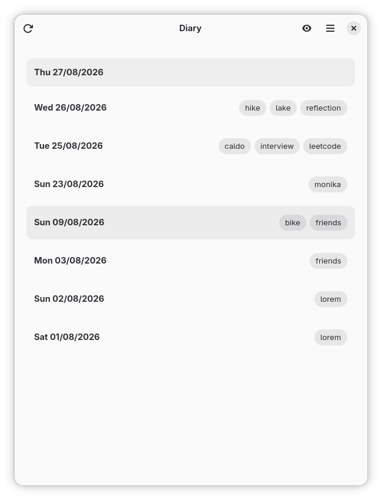
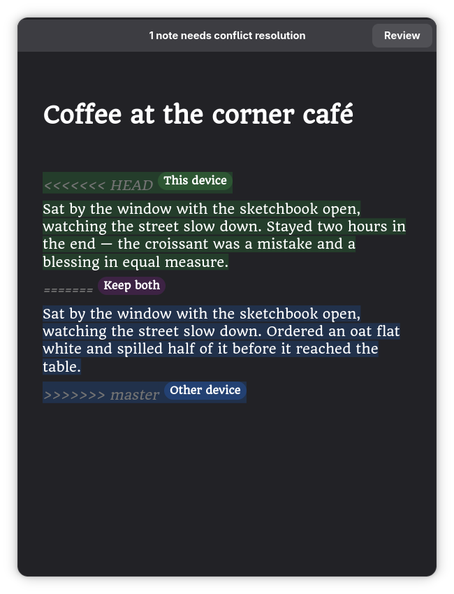

# Diary

A journal app for GNOME, built on top of the [penna engine](https://www.github.com/enfff/penna).
Entries are plain Markdown files in a git repo, so history and sync come from git, and your notes stay readable even without this app.

## Build

Open the folder in GNOME Builder and press run. Or by hand:

    meson setup _build
    ninja -C _build
    ninja -C _build install

Needs Rust 1.92+ and GTK4/libadwaita (GNOME 50 era).

## Notes

- One entry per day, saved as `YYYYMMDDHHmm.md`
- Syncing is just git; conflicts get their own little resolver UI
- Translations live in `po/` (de, fr, it so far)

## License

GPL-3.0-or-later. Contributions follow the
[GNOME Code of Conduct](https://conduct.gnome.org/).
